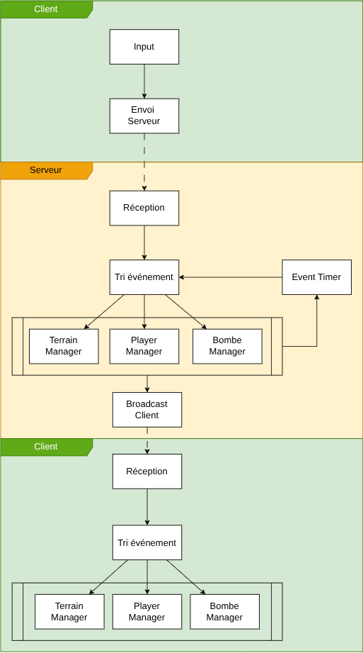

# BomberPerson

Un clone multijoueur de **Bomberman** réalisé en C# avec [MonoGame](https://www.monogame.net/) dans le cadre du cours **PLM** (HEIG-VD).

Les joueurs s'affrontent en réseau local : un joueur héberge la partie, les autres rejoignent via son adresse IP. Le dernier survivant gagne.



## Sommaire

- [Prérequis](#prérequis)
- [Installation](#installation)
- [Build](#build)
- [Lancer le jeu](#lancer-le-jeu)
- [Jouer](#jouer)
- [Contrôles](#contrôles)
- [Structure du projet](#structure-du-projet)
- [Licence](#licence)

## Prérequis

- **.NET SDK 9.0** ou plus récent — [télécharger ici](https://dotnet.microsoft.com/download)
- Un OS supporté par MonoGame DesktopGL : **Windows**, **Linux** ou **macOS**
- (Optionnel) Un IDE : Visual Studio 2022, JetBrains Rider ou VS Code avec l'extension C#

Vérifier que le SDK est bien installé :

```sh
dotnet --version
```

> Doit afficher `9.0.x` ou plus.

## Installation

Cloner le dépôt :

```sh
git clone https://github.com/<votre-utilisateur>/bomber-person.git
cd bomber-person
```

Restaurer les outils MonoGame (`mgcb` pour le pipeline de contenu) et les paquets NuGet :

```sh
dotnet tool restore
dotnet restore
```

## Build

Compiler l'ensemble de la solution :

```sh
dotnet build BomberPerson.sln -c Release
```

Le build compile aussi automatiquement le contenu (polices, niveaux, etc.) via `MonoGame.Content.Builder.Task`.

> Sur **Linux** et **macOS**, seul le projet `BomberPerson.DesktopGL` est nécessaire ; les projets `Android` et `iOS` peuvent être ignorés. Pour ne builder que le projet desktop :
>
> ```sh
> dotnet build BomberPerson.DesktopGL/BomberPerson.DesktopGL.csproj -c Release
> ```

## Lancer le jeu

Depuis la racine du projet :

```sh
dotnet run --project BomberPerson.DesktopGL -c Release
```

Une fenêtre 1280×720 s'ouvre sur le menu principal.

## Jouer

Le jeu est multijoueur (jusqu'à **4 joueurs**) et fonctionne en architecture **client / serveur** sur le réseau local.

### Héberger une partie

1. Sur le menu principal, cliquer sur **Host Game**.
2. Renseigner :
   - **Nom de la partie**
   - **Port** (par défaut `7777`, entre 1024 et 65535)
   - **Mot de passe** (optionnel)
3. Cliquer sur **Créer**. Vous arrivez dans le lobby en tant qu'hôte.
4. Communiquer votre **adresse IP locale** et le **port** aux autres joueurs.

> Pensez à autoriser le port choisi dans le pare-feu si nécessaire.

### Rejoindre une partie

1. Sur le menu principal, cliquer sur **Join Game**.
2. Renseigner :
   - **Nom du joueur**
   - **Adresse IP** de l'hôte (`127.0.0.1` pour tester en local sur la même machine)
   - **Port** (le même que l'hôte)
   - **Mot de passe** si la partie en a un
3. Cliquer sur **Rejoindre**.

### Démarrer la partie

Dans le lobby, chaque joueur clique sur **Prêt**. Lorsque tous les joueurs sont prêts, un compte à rebours démarre la partie automatiquement.

## Contrôles

| Action            | Touche(s)                  |
|-------------------|----------------------------|
| Se déplacer       | `Z` `Q` `S` `D` ou `W` `A` `S` `D` ou flèches |
| Poser une bombe   | `Espace` ou `X`            |
| Quitter le jeu    | `Échap`                    |
| Quitter le lobby  | Bouton **Quit** en jeu     |

## Structure du projet

```
bomber-person/
├── BomberPerson.sln              # Solution principale
├── BomberPerson.Core/            # Logique du jeu (partagée entre plateformes)
│   ├── Client/                   # Code client (connexion, gestion d'état)
│   ├── Server/                   # Code serveur (simulation, broadcast)
│   ├── Scene/                    # Scènes : menu, lobby, jeu, fin de partie
│   ├── State/                    # État du jeu et messages réseau
│   ├── UI/                       # Composants UI (boutons, champs texte)
│   ├── Content/                  # Pipeline MonoGame (polices, niveaux)
│   └── Settings.cs               # Constantes (taille tuile, joueurs max, etc.)
├── BomberPerson.DesktopGL/       # Cible Windows / Linux / macOS
├── BomberPerson.Android/         # Cible Android
├── BomberPerson.iOS/             # Cible iOS
├── images/                       # Diagrammes (architecture, flux)
└── rapport-final-plm.pdf         # Rapport final du projet
```

## Licence

Distribué sous licence **MIT**. Voir [LICENSE](LICENSE).

© 2026 — Raphael Perret & Florian Duruz